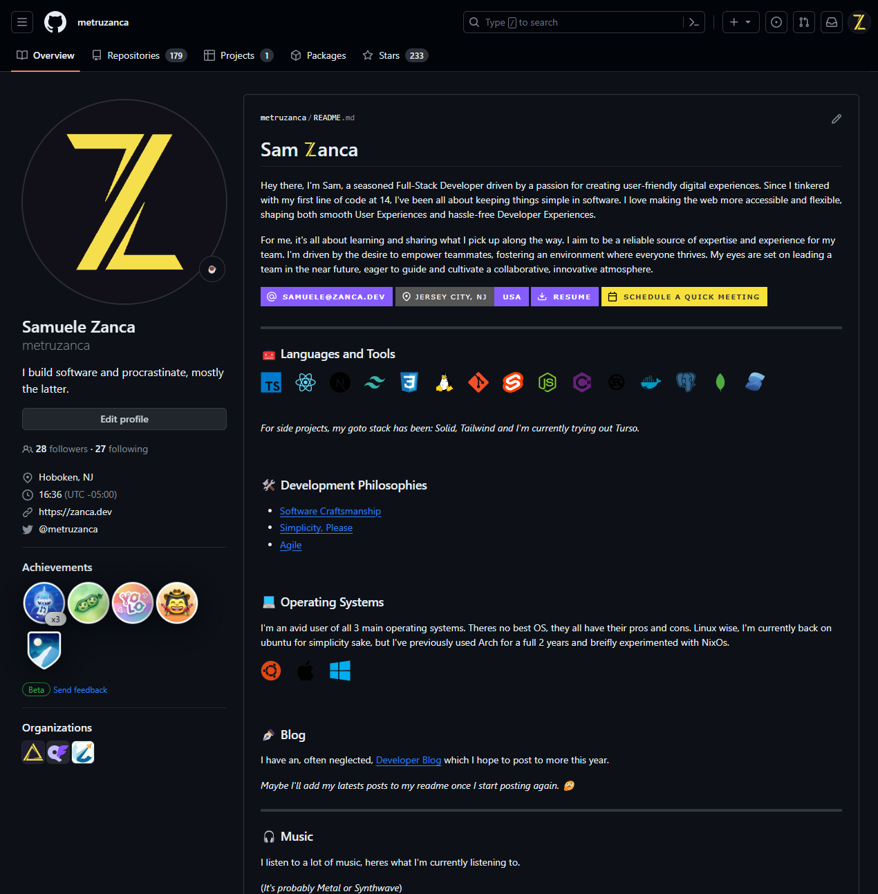
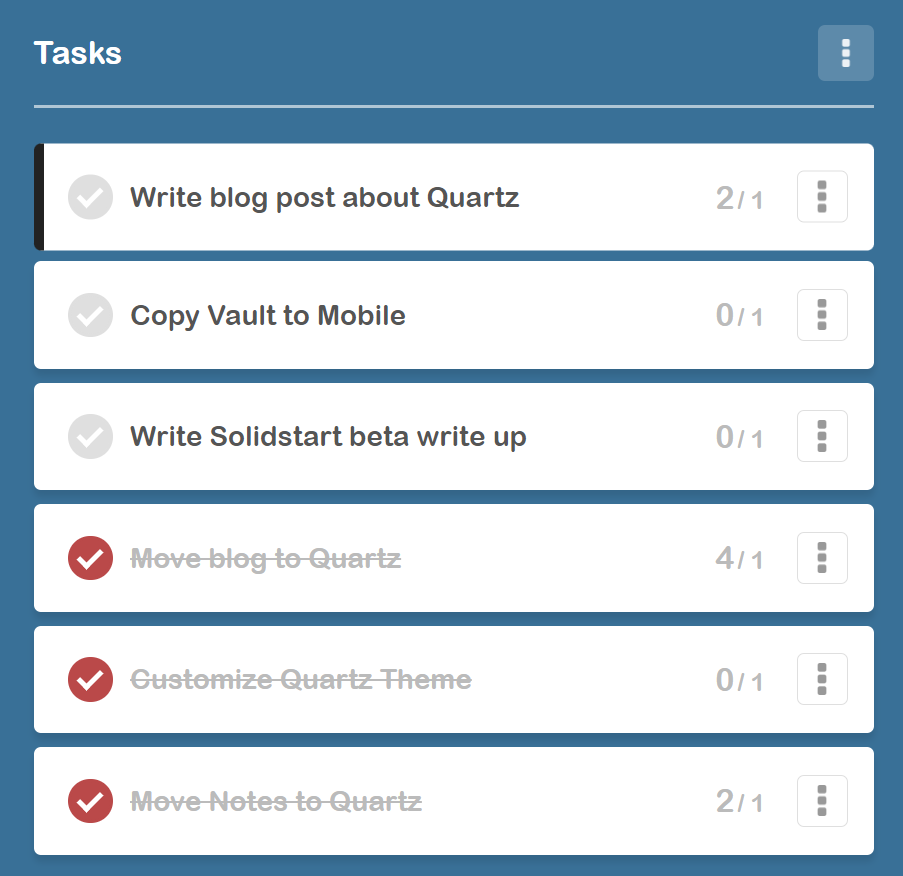

> [!tldr]
> If you don't want all the backstory and just want to skip to the technical bits on how to use quarts for blogging and note taking with obsidian as your editor, [click here](https://zanca.dev/blog/quartz#setting-up-quartz).
## Prologue - Dealing with perfectionism

I've been wanting to write blog posts, for a while now. Posts about things I'm learning, things I'm building and most importantly mistakes I've made.

The roadblock that's always been in my way has been my stubbornness.

> [!quote]
> "_I'm a web developer, I should build my own blog from **scratch**!_"

Having a highly customized site would be awesome, and there's tons of great ones out there. Here's just a few of my favorites:

- https://ryanmulligan.dev/blog/layout-breakouts
- https://swyxkit.netlify.app/layout-breakouts-in-swyxkit
- https://www.joshwcomeau.com/css/full-bleed
- https://tkdodo.eu/blog/2023-in-review
- https://hackerstations.com
- https://marvinh.dev
- https://tobiasahlin.com
- wattenberger.com
	- https://2019.wattenberger.com
	- https://wattenberger.com

All those blogs are awesome. _Especially Amelia's blog, who with just a glance will give all us mere mortals imposter syndrome no matter how long we've been in the industry._

The problem with all these developers sites, is they didn't start blogging with a cool site. They started with some kind of blogging platform like: [dev.to](https://dev.to/), [hashnode.com](https://hashnode.com/), or the [OG](http://og.urbanup.com/10118301) [Medium](https://medium.com/). Heck some developers happily use the default blog starter template of xyz framework.

What better person to use as an example than Dan Abramov with his site [overreacted.io](https://overreacted.io/). _In case you've been living under a rock, Dan created ~~React.js~~.. er I mean.. Redux and Create-React-App. Oh and he works on the react core team at facebook._

Another example, we've got Ryan Carnianto who still just [blogs to Devto](https://dev.to/ryansolid). Who is Ryan? Creator of [Solidjs](https://www.solidjs.com/), the framework that got everyone talking about Signals. If like me, you watch a lot of "Dev Youtube", SolidJS is the framework beloved by **Both** [@ThePrimeagen](https://www.youtube.com/@theprimeagen) and [@t3dotgg](https://www.youtube.com/@t3dotgg).

Alright, we don't need to make our own. So what am I using?

Hold up, there's still some more backstory. Another "problem". Well, its not a problem per say, I just made it a problem, because I love getting in my own way.

I want to be able to edit my blog post drafts from all my devices, including my phone. During 2021, I fell in Love with a little quarantine project by the name of [Obsidian](https://obsidian.md). I loved the editor experience and wanted to use that for everything.

> One thing to note with obsidian, while obsidian supports traditional markdown likes e.g. `[text](relative-url)`, those can get cumbersome and obsidian defaults to using "wiki-links" e.g. `[[shortest-url]] or [[shortest-url|text]]`. And I much prefer wiki-links. So whatever I use needed to support wiki-links.

So, I tried making site after site:

- https://github.com/metruzanca/zbest.dev-v1-unfinished
- https://github.com/metruzanca/zanca.dev-gatsby
- https://github.com/metruzanca/zanca.dev-v3 - I found obsidian before this one
- https://github.com/metruzanca/zanca.dev-vite
- https://github.com/metruzanca/zanca.dev-v4 _was really happy with this and started writing, but I did the css while at 33% zoom by accident :facepalm: and that demoralized me and I quit writing._

And every time I had something, I just wasn't satisfied and I told myself "I couldn't blog until it was **Perfect**".

## Enter Quartz

I was looking for a tool to make some documentation/[wiki for a project](https://convergence-wiki.vercel.app/) and I stumbled upon [Quartz](https://quartz.jzhao.xyz/). Quartz is a static site generator [FOSS](https://www.urbandictionary.com/define.php?term=FOSS) alternative to Obsidian Publish.

I tried it out for that project of mine and I loved it and instantly knew I needed to use it for my blog. The default site is gorgeously styled and would allow me to use Obsidian for editing and git for publishing.

## Setting up Quartz

All I did was follow the documentation to create the starter project, change a few strings (like site name) and following their docs, I adjusted the layout a bit. I didn't spend much time on this step, most of my time was importing all my old blog posts.

While importing them, I didn't like how long my urls were, so I updated all my blog posts to have short urls. Maintaining canonical URLs is good for SEO, but none of my previews sites didn't have sitemaps and lets be real, most of my old blog posts aren't interesting or useful. I've archived a few really _bad_ ones but I'll keep some for posterity.

By default Quartz comes with `Plugin.RemoveDrafts()` which is essentially an "opt-out" of being published. My plan was to unify my personal notes and blog into one Obsidian Vault, so this would be very tedious. Fortunately, Quartz has a second plugin `Plugin.ExplicitPublish()` which is perfect for my needs.

One additional benefit to the `ExplicitPublish` is I can publish individual notes that aren't in my blog folder. This way, say I've written up a personal note on how to use Postgres in docker, I can just publish that single note. (_If this file links to other non-published files, Quartz won't publish those_)

Aside from this plugin swap, the only other two major changes to Quartz's `quartz.config.ts` & `quartz.layout.ts` files was disable the Graph component and add a component to create a list of recent posts on the sidebar on desktop and above the footer on mobile.

```tsx
Component.RecentNotes({
  title: "Recent Blog Posts",
  limit: 3,
  filter: (f) => (
    f.slug!.startsWith("blog/")
    && f.slug! !== "posts/index"
    && !f.frontmatter?.noindex
  ),
  linkToMore: "blog/" as SimpleSlug,
}),
```

Aside from that, at the moment, I'm pretty much using stock Quartz. Is my blog perfect? No. I'm itching to restyle it to match my colors in https://zanca-dev-v4.vercel.app.

## My landing page

None of my previous sites had a landing page. I always wanted to make something cool like what my good friend [Federico Terzi](https://federicoterzi.com/) made on his site. (_federico is the author of a super cool text-expander app called [Espanso](https://espanso.org), you should go check it out!_)

But honestly, I'm not very creative. Give me a Figma and I'll make it pixel perfect, responsive and give it that "feel good"/"power user touch" that apps like [linear](https://linear.app) have.

Instead, while going to my [Github profile](https://github.com/metruzanca) looking for one of my old site repositories as inspiration, I had a realization.



I already have the perfect landing page.

And now, with my site done, I can start writing! (*aka this article*) Just note, when I say "Done", I mean done. Not perfect. I set a goal this morning, and I got that goal Done.

Actually I set up a few using [pomofocus.io](https://pomofocus.io/):



## Quartz on mobile

> Originally, I thought we could use `git sparse-checkout set content` to reduce the amount of files that needed to be checked for updates to improve obsidian-git's performance on mobile. But unfortunately, [Isomorphic-git](https://isomorphic-git.org/) which is what powers obsidian-git, doesn't support sparse mode. If you try it, obsidian will throw an error telling you to create an issue on the isomorphic-git repository.

> [!abstract]- If you're interested, here's what I wrote thinking this would work. Oops
> Since, we won't be editing code on mobile and all we care about is the markdown files inside the `/content` directory, we don't need to clone anything else.
>
> What we'll do next is clone the repository with some flags on our PC then move the cloned repository on to our Android device.
>
> TL;DR; here's the code
> ```bash
> git clone --filter=blob:none --no-checkout https://github.com/user/repository.git;
> cd repository
> git sparse-checkout set content;
> git checkout;
> ```
> The magic happens in two parts:
>
> First we clone with the two flags: `--filter=blob:none --no-checkout` which will give us an empty working tree and will set the repository to lazily load the history of all the files from the remote.
>
> Second we we use the `sparse-checkout` command to set it up such that when we `checkout` only the contents of the `content` directory will be pulled.
>
> Lets see how that looks...
>
> [](https://asciinema.org/a/SoUCqbeVkHA36nXhNkvvdeVYz)
> As you can see, when we clone the repository, its initially empty with just the hidden `.git/` directory. Then after setting the `sparse-checkout` directory and `checking` out we end up with just the content folder.
> There's one last step that I can't show I'm afraid, and thats because we need to create a personal_access_token on github and use that in our clone URL.

Following their documentation https://publish.obsidian.md/git-doc/Getting+Started#Mobile

I was able to clone the repo on my PC, then move the file to my android device. Once there, it all opens fine and _does work_, though with pretty bad performance on the `git status` checks. This is because of all the files in the quartz directory slowing things down.

One idea is to use a submodule for the content, but getting the build on vercel to trigger when a submodule updates is going to be difficult. I can apparently get it to work with 2 github actions but its kind of spaghetti infrastructure at that point: https://www.perplexity.ai/search/github-action-detect-QLw0F4PRR1iaPObfmpKG4A?s=c

Ideally, this would be solved in Quartz itself, by moving all `/quartz` files to a npm package akin to how a framework like [Solidstart](https://start.solidjs.com/getting-started/what-is-solidstart) has a package [@solidjs/start](https://www.npmjs.com/package/@solidjs/start) that contains the framework and in the repository we've got just a few files that hook into the APIs exposed by the package.

I might reach out to quartz and ask if that idea is in the cards or if they wanted help with figuring it out.

---

I'm calling that a day. Overall, I'm very satisfied with the outcome and I'm excited to start writing more posts. _Although, probably not using obsidian-git on mobile yet_.
